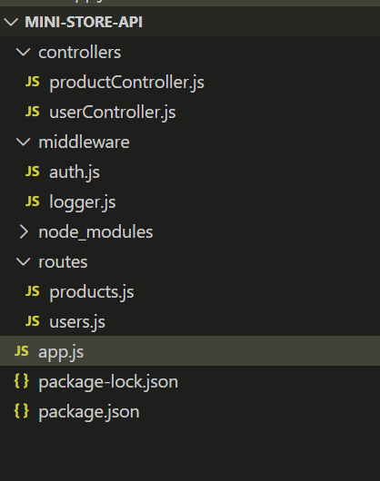
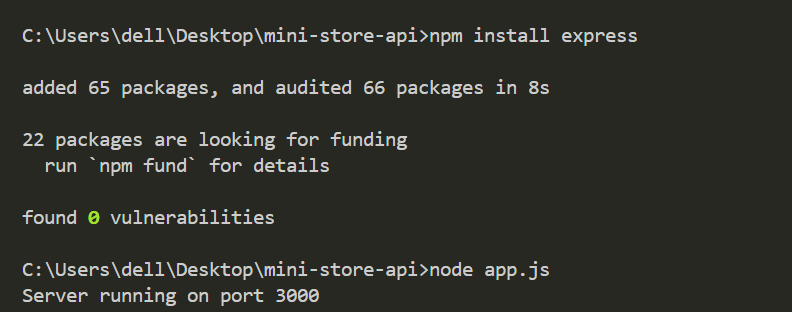
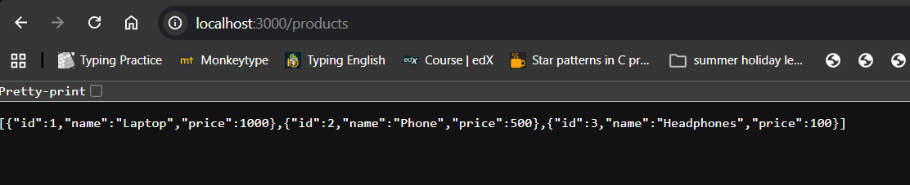

# Mini Online Store API

## Project Introduction

This project is a simple backend API built using Express.js.
It demonstrates middleware, routing, Express Router, and MVC folder structure.

---

## Technologies Used

* Node.js
* Express.js
* JavaScript

---

## Folder Structure

mini-store-api

app.js
routes
controllers
middleware

---

## API Routes

### GET /products

Returns list of products.

### GET /users/:id

Returns user ID using route parameters.

Example:
GET /users/5

### POST /users

Creates a new user using JSON body.

Example:

{
"name": "Ali",
"email": "[ali@gmail.com](mailto:ali@gmail.com)"
}

---

## How to Run the Project

1 Install Node.js
2 Open project folder in VS Code
3 Install dependencies

npm install

4 Run server

node app.js

Server runs on:

http://localhost:3000

---

## Screenshots
### Project Folder Structure

### Server Running

### Products API Output

